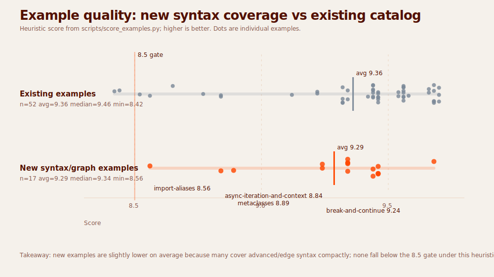

# Example quality: new vs existing examples

Scores come from `scripts/score_examples.py`, so this is a heuristic audit rather than a human rubric review. The “new” cohort is the syntax-surface/graph expansion added after commit `f6019d5`.

| Cohort | Count | Average | Median | Min | Max |
|---|---:|---:|---:|---:|---:|
| Existing examples | 52 | 9.36 | 9.46 | 8.42 | 9.70 |
| New syntax/graph examples | 17 | 9.29 | 9.34 | 8.56 | 9.68 |

Lowest-scoring new examples under the heuristic:

- `import-aliases` — 8.56
- `async-iteration-and-context` — 8.84
- `metaclasses` — 8.89
- `break-and-continue` — 9.24
- `exception-groups` — 9.24
- `assignment-expressions` — 9.34
- `loop-else` — 9.34
- `positional-only-parameters` — 9.34

The new examples are slightly lower on average because they cover compact, advanced, or edge-case syntax. That suggests the next editorial pass should deepen the lowest-scoring new pages with stronger problem framing and contrast, not remove them.
